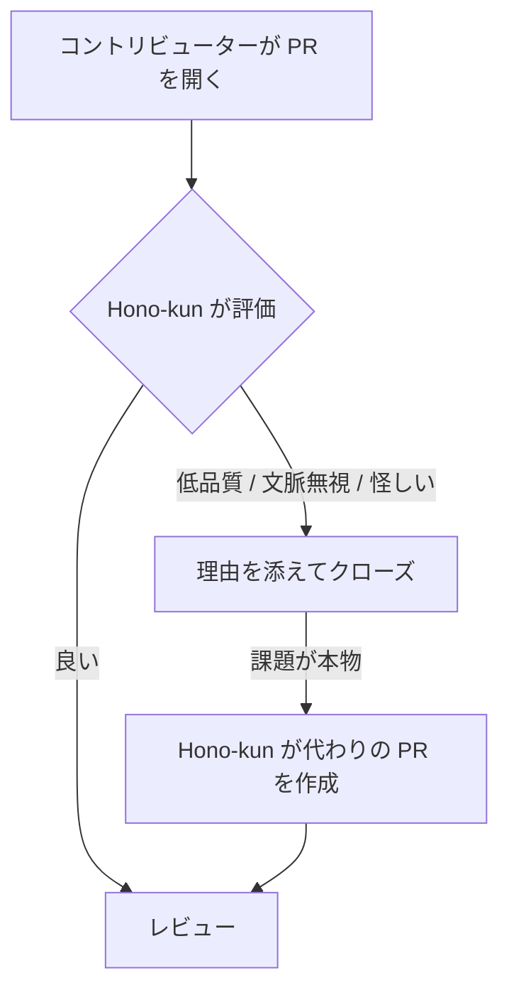

<p align="center">
  
</p>

# Hono-kun

[English](README.md) | 日本語

Hono-kun は [Hono](https://github.com/honojs/hono) の AI メンテナーです。

やってくる Pull Request を評価し、自ら行動します。良い PR はレビューへ進み、低品質・文脈を無視している・作者が怪しい PR は理由を添えてクローズします。クローズした PR が本物の課題を指している場合は、Hono-kun 自身が代わりの PR を作成します — 元の PR を参照しつつ、コードは一から自分で考えたものです。

> [!NOTE]
> このプロジェクトはまだ非常に初期の段階です — 役に立つものはまだ何もありません。

## 仕組み



評価は読み取り専用のエージェントが行います。GitHub への書き込みはすべて単一の信頼された publisher を経由し、判断の閾値はプライベートな policy サービスに置かれるため、自律性は段階的に引き上げられます。アーキテクチャは意図的に PR 専用にしていません。Issue のトリアージや再現、その他のメンテナンスタスクが今後続きます。

## アーキテクチャ

Hono-kun は Service Binding でつながった小さな Cloudflare Worker の集まりで、すべての接続点に厳格なトラストバウンダリがあります。現在動いている評価パイプライン:

```text
GitHub webhook
  → apps/github        署名検証、配信の重複排除 (KV)、トリガー判定、diff 取得
  → Service Binding    相手側に公開ルートなし、管理すべき認証もなし
  → apps/agents        Flue エージェント — 会話ごとに 1 つの Durable Object
  → AI Gateway         Unified Billing: プロバイダの API キーはどこにも存在しない
  → Claude             構造化された判定を生成
```

コンポーネント:

- **`apps/github`** — GitHub に面した公開 Worker。インターネットに露出しているのはこれだけで、GitHub への書き込みクレデンシャルは持ちません。Hono 製です。
- **`apps/agents`** — [Flue](https://github.com/withastro/flue) エージェントの Worker（現在は Reviewer。verifier、contributor、coder が続きます）。ルートを一切持たず、Service Binding 経由でのみ到達できます。モデル呼び出しは AI Gateway を通るため、システムのどこにもプロバイダ API キーが存在しません。
- **`apps/publisher`** — 特権的な GitHub 書き込みクレデンシャルを持つ_唯一_のコンポーネントとなる、独立した信頼済み Worker。PR のクローズ、コメント投稿、Hono-kun 自身の PR 作成はすべてここを経由します。
- **`workflows/*`** — PR トリアージのような具体的なタスクに向けたエージェントのオーケストレーション。
- **`packages/policy`** — ポリシー判断のインターフェースと型のみ。Hono の本番ポリシーの実体は別のプライベート Worker にあり、Cloudflare Service Binding で接続されます。この公開リポジトリはそれなしで常にビルドできます。

現在パイプラインはシャドーモードで動いています。判定はログでのみ観測でき、GitHub には何も書き込まれません。また、`ai:evaluate` ラベルを付けることで、新旧を問わず任意の PR を手動で評価できます。

## リポジトリ構成

```text
hono-kun/
├── apps/
│   ├── github/          # GitHub に面した公開 Worker (Hono)
│   ├── agents/          # Flue エージェントの Worker (Service Binding のみ)
│   └── publisher/       # 特権的な GitHub 書き込みのための信頼済み Worker
├── agents/
│   ├── verifier/        # 変更が主張どおり動くか検証する
│   ├── reviewer/        # コードの変更をレビューする
│   ├── contributor/     # コントリビューターとやりとりする
│   └── coder/           # コードを書き、修正する
├── workflows/
│   └── pull-request/    # Pull Request トリアージのオーケストレーション
├── packages/
│   ├── github/          # 読み取り側の GitHub ヘルパー
│   ├── sandbox/         # Cloudflare Sandbox 実行ヘルパー
│   ├── schemas/         # 共有型
│   ├── policy/          # ポリシー判断のインターフェース（コントラクトのみ）
│   └── config/          # 共有ランタイム設定
├── skills/              # エージェントが使うスキル
└── evals/               # 評価スイート
```

## 開発

必要なもの: Node.js >= 20 と [pnpm](https://pnpm.io/)。

```sh
pnpm install
pnpm typecheck
pnpm test
pnpm lint
pnpm format
```

Worker をローカルで動かすには:

```sh
pnpm --filter @hono-kun/app-github dev
```

内部パッケージにビルドステップはありません。ワークスペースパッケージは TypeScript ソースをそのまま公開し、Worker は Wrangler がバンドルします。

## 技術スタック

- TypeScript + pnpm workspaces
- HTTP アプリケーションに [Hono](https://hono.dev/)
- エージェントに [Flue](https://github.com/withastro/flue)
- API キーなしで Claude を呼ぶための [Cloudflare AI Gateway](https://developers.cloudflare.com/ai-gateway/)（Unified Billing）
- リントとフォーマットに [oxlint](https://oxc.rs/) と [oxfmt](https://oxc.rs/)
- デプロイターゲットは Cloudflare Workers、Service Binding で接続

## Author

Yusuke Wada <https://github.com/yusukebe>

## License

MIT
