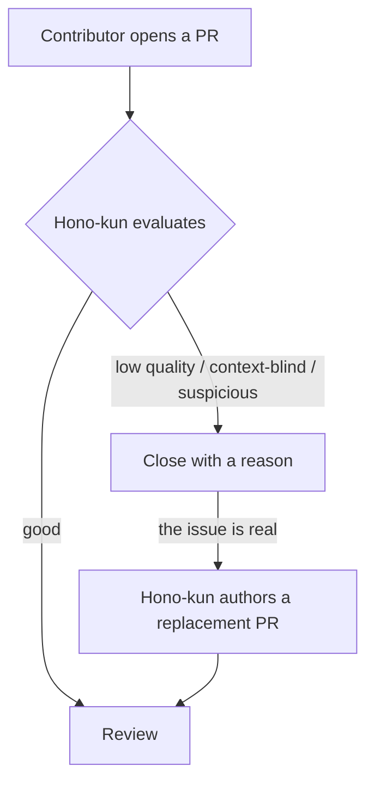

<p align="center">
  
</p>

# Hono-kun

Hono-kun is an AI maintainer for [Hono](https://github.com/honojs/hono).

It evaluates incoming pull requests and acts on them: good ones proceed to review; low-quality, context-blind, or suspicious ones are closed with a reason. When a closed PR points at a real issue, Hono-kun authors a replacement PR itself — referencing the original, with code it derives from scratch.

> [!NOTE]
> This project is at a very early stage — nothing useful is implemented yet.

## How it works



Evaluation is done by read-only agents. Every GitHub write goes through a single trusted publisher, and the decision thresholds live in a private policy service, so autonomy can be dialed up gradually. The architecture is deliberately not PR-specific: issue triage, issue reproduction, and other maintenance tasks will follow.

## Architecture

Hono-kun is a set of small Cloudflare Workers connected by Service Bindings, with a strict trust boundary at every hop. The evaluation pipeline running today:

```text
GitHub webhook
  → apps/github        signature verification, delivery dedup (KV), trigger decision, diff fetch
  → Service Binding    no public route on the other side, no auth to manage
  → apps/agents        Flue agents — one Durable Object per conversation
  → AI Gateway         unified billing: no provider API keys anywhere
  → Claude             produces a structured verdict
```

The components:

- **`apps/github`** — the public GitHub-facing Worker. The only thing exposed to the internet; it holds no GitHub write credentials. Built with Hono.
- **`apps/agents`** — the [Flue](https://github.com/withastro/flue) agents Worker (Reviewer today; verifier, contributor, and coder to follow). It has no route at all — reachable only via a Service Binding. Model calls go through the AI Gateway, so no provider API keys exist anywhere in the system.
- **`apps/publisher`** — a separate trusted Worker that will be the _only_ component holding privileged GitHub write credentials. Everything that closes PRs, posts comments, or opens Hono-kun's own PRs goes through it.
- **`workflows/*`** — orchestration of agents for a concrete task, such as pull request triage.
- **`packages/policy`** — interfaces and types for policy decisions only. The real production policy for Hono lives in a separate private Worker and is connected via a Cloudflare Service Binding. This public repository always builds without it.

Right now the pipeline runs in shadow mode: verdicts are only observable in logs, and nothing is written to GitHub. A PR can also be evaluated manually — on any PR, old or new — by adding the `ai:evaluate` label.

## Repository structure

```text
hono-kun/
├── apps/
│   ├── github/          # Public GitHub-facing Worker (Hono)
│   ├── agents/          # Flue agents Worker (Service Binding only)
│   └── publisher/       # Trusted Worker for privileged GitHub writes
├── agents/
│   ├── verifier/        # Verifies changes behave as claimed
│   ├── reviewer/        # Reviews code changes
│   ├── contributor/     # Interacts with contributors
│   └── coder/           # Writes and modifies code
├── workflows/
│   └── pull-request/    # Pull request triage orchestration
├── packages/
│   ├── github/          # Read-side GitHub helpers
│   ├── sandbox/         # Cloudflare Sandbox execution helpers
│   ├── schemas/         # Shared types
│   ├── policy/          # Policy decision interfaces (contract only)
│   └── config/          # Shared runtime configuration
├── skills/              # Skills used by agents
└── evals/               # Evaluation suites
```

## Development

Requirements: Node.js >= 20 and [pnpm](https://pnpm.io/).

```sh
pnpm install
pnpm typecheck
pnpm test
pnpm lint
pnpm format
```

To run a Worker locally:

```sh
pnpm --filter @hono-kun/app-github dev
```

There is no build step for internal packages: workspace packages expose TypeScript source directly, and the Workers are bundled by Wrangler.

## Tech stack

- TypeScript + pnpm workspaces
- [Hono](https://hono.dev/) for HTTP applications
- [Flue](https://github.com/withastro/flue) for agents
- [Cloudflare AI Gateway](https://developers.cloudflare.com/ai-gateway/) (unified billing) for calling Claude without API keys
- [oxlint](https://oxc.rs/) and [oxfmt](https://oxc.rs/) for linting and formatting
- Cloudflare Workers as the deployment target, glued together with Service Bindings

## Author

Yusuke Wada <https://github.com/yusukebe>

## License

MIT
